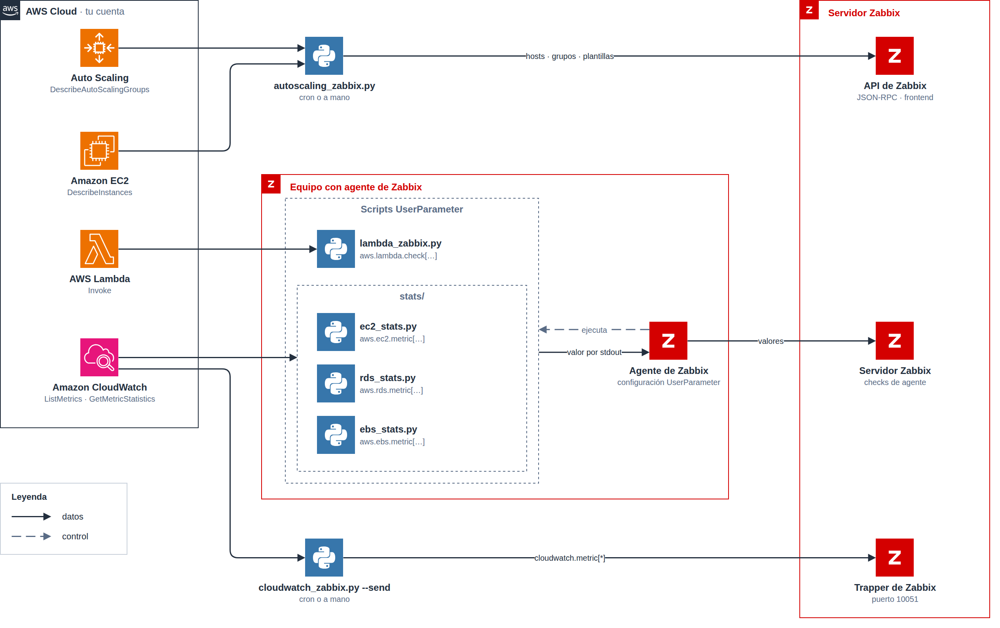
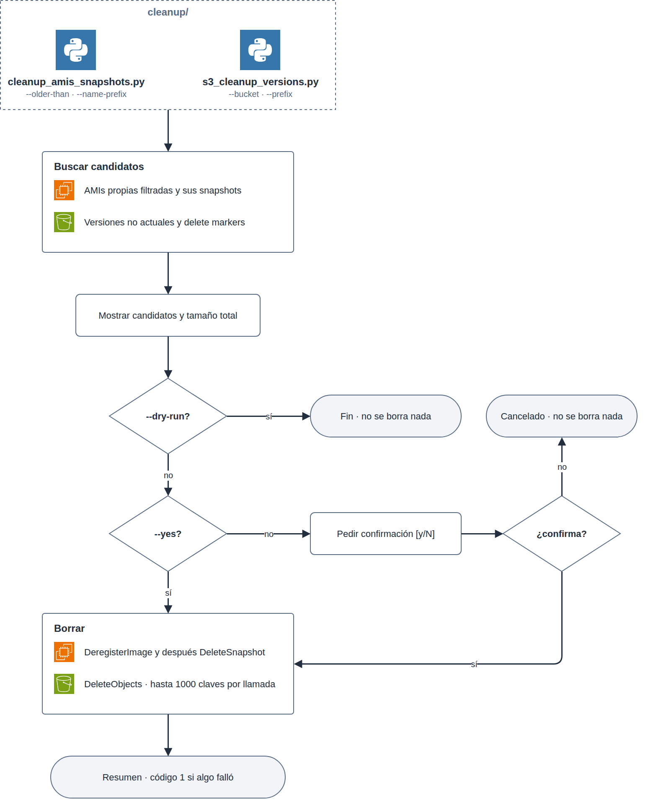

# aws-zabbix-toolkit

Colección de scripts en Python 3 para integrar recursos de AWS (Auto Scaling, CloudWatch, EC2, RDS, EBS, Lambda) con **Zabbix**, y para tareas de limpieza y ahorro de costes (AMIs/snapshots huérfanos, versiones antiguas en buckets S3 versionados).

Todos los scripts son independientes entre sí (no comparten módulos locales), usan `argparse` y se pueden consultar con `--help`.

## Índice

- [Arquitectura](#arquitectura)
- [Requisitos](#requisitos)
- [Instalación](#instalación)
- [Credenciales de AWS](#credenciales-de-aws)
- [Conexión con Zabbix](#conexión-con-zabbix)
- [Estructura del repositorio](#estructura-del-repositorio)
- [Scripts](#scripts)
  - [zabbix/autoscaling_zabbix.py](#zabbixautoscaling_zabbixpy)
  - [zabbix/cloudwatch_zabbix.py](#zabbixcloudwatch_zabbixpy)
  - [zabbix/lambda_zabbix.py](#zabbixlambda_zabbixpy)
  - [stats/ec2_stats.py](#statsec2_statspy)
  - [stats/rds_stats.py](#statsrds_statspy)
  - [stats/ebs_stats.py](#statsebs_statspy)
  - [cleanup/cleanup_amis_snapshots.py](#cleanupcleanup_amis_snapshotspy)
  - [cleanup/s3_cleanup_versions.py](#cleanups3_cleanup_versionspy)
- [Ejemplos de UserParameter de Zabbix](#ejemplos-de-userparameter-de-zabbix)
- [Seguridad en los scripts de limpieza](#seguridad-en-los-scripts-de-limpieza)
- [Tests](#tests)
- [Licencia](#licencia)

## Arquitectura

<p align="center"></p>

Los scripts de monitorización llevan los datos a Zabbix por tres vías:

- **API de Zabbix (JSON-RPC)**: `autoscaling_zabbix.py` lee los grupos de Auto Scaling y sus instancias, mantiene en Zabbix los hosts, sus grupos y sus plantillas, y deshabilita los hosts cuya instancia ya no está en el grupo.
- **Trapper**: `cloudwatch_zabbix.py --send` lee las métricas de CloudWatch de un recurso y envía el último valor de cada una como items `cloudwatch.metric[...]` al puerto 10051.
- **UserParameter**: el agente de Zabbix ejecuta `lambda_zabbix.py` y los scripts de `stats/`, que consultan AWS y devuelven un único valor por salida estándar.

Los scripts de `cleanup/` no hablan con Zabbix; sus protecciones están en [Seguridad en los scripts de limpieza](#seguridad-en-los-scripts-de-limpieza). Los diagramas son editables en [`docs/diagrams/`](docs/diagrams/).

## Requisitos

- **Python 3.9 o superior** (los scripts usan `str.removesuffix`, disponible desde 3.9).
- Una cuenta de AWS con credenciales válidas.
- Un servidor Zabbix accesible, solo para `autoscaling_zabbix.py` y, si se usa `--send`, para `cloudwatch_zabbix.py`. El resto de scripts no se conectan a Zabbix: imprimen un valor por `stdout` pensado para que lo recoja el propio agente de Zabbix.

Las dependencias de Python exactas están en [`requirements.txt`](requirements.txt) (ejecución) y [`requirements-dev.txt`](requirements-dev.txt) (tests).

## Instalación

```bash
git clone https://github.com/PedroFernandz/aws-zabbix-toolkit.git
cd aws-zabbix-toolkit

python3 -m venv venv
source venv/bin/activate

pip install -r requirements.txt
```

Para poder ejecutar los tests hace falta además:

```bash
pip install -r requirements-dev.txt
```

## Credenciales de AWS

Ningún script acepta claves de acceso por línea de comandos. Todos usan `boto3.Session(profile_name=..., region_name=...)`, que resuelve las credenciales con la cadena estándar de boto3, en este orden:

1. Variables de entorno (`AWS_ACCESS_KEY_ID`, `AWS_SECRET_ACCESS_KEY`, `AWS_SESSION_TOKEN`).
2. El fichero `~/.aws/credentials` (perfiles) y `~/.aws/config`.
3. Variables de entorno `AWS_PROFILE` / `AWS_DEFAULT_REGION`.
4. Credenciales de un rol de IAM asignado a la instancia EC2, tarea ECS/Fargate o función Lambda donde se ejecute el script.

Todos los scripts aceptan además estos dos flags, que tienen prioridad sobre lo anterior:

- `--profile NOMBRE`: usa un perfil con nombre de `~/.aws/credentials` en vez de la cadena de credenciales por defecto.
- `--region REGION` (`-r` en los scripts de `stats/`): fuerza la región de AWS, en vez de usar la del perfil/entorno.

### Permisos de IAM mínimos por script

| Script | Acciones de IAM mínimas |
| --- | --- |
| `zabbix/autoscaling_zabbix.py` | `autoscaling:DescribeAutoScalingGroups`, `ec2:DescribeInstances` |
| `zabbix/cloudwatch_zabbix.py` | `cloudwatch:ListMetrics`, `cloudwatch:GetMetricStatistics` |
| `zabbix/lambda_zabbix.py` | `lambda:InvokeFunction` (sobre la función indicada) |
| `stats/ec2_stats.py` | `ec2:DescribeInstances`, `cloudwatch:GetMetricStatistics` |
| `stats/rds_stats.py` | `cloudwatch:GetMetricStatistics` |
| `stats/ebs_stats.py` | `cloudwatch:GetMetricStatistics`; además `ec2:DescribeVolumes` si se usa `--instance-id` en lugar de `--volume-id` |
| `cleanup/cleanup_amis_snapshots.py` | `ec2:DescribeImages`, `ec2:DescribeSnapshots`, `ec2:DeregisterImage`, `ec2:DeleteSnapshot` |
| `cleanup/s3_cleanup_versions.py` | `s3:ListBucketVersions` sobre el bucket, `s3:DeleteObjectVersion` sobre los objetos |

Con `--dry-run` los scripts de limpieza solo necesitan los permisos de lectura (`Describe*`/`List*`); los de borrado (`Deregister*`, `Delete*`) solo hacen falta para ejecutar el borrado real.

## Conexión con Zabbix

Solo dos scripts hablan directamente con un servidor Zabbix:

- **`zabbix/autoscaling_zabbix.py`** usa la **API JSON-RPC de Zabbix** para crear/actualizar hosts. Necesita la URL de la API y, o bien un token, o bien usuario y contraseña:

  | Variable de entorno | Flag equivalente | Descripción |
  | --- | --- | --- |
  | `ZABBIX_URL` | `--zabbix-url` | URL de `api_jsonrpc.php` (obligatoria) |
  | `ZABBIX_TOKEN` | `--zabbix-token` | Token de API |
  | `ZABBIX_USER` | `--zabbix-user` | Usuario de la API (si no se usa token) |
  | `ZABBIX_PASSWORD` | `--zabbix-password` | Contraseña de la API (si no se usa token) |

- **`zabbix/cloudwatch_zabbix.py`** solo necesita conexión a Zabbix cuando se ejecuta con `--send`, ya que en ese caso envía los datos por el **protocolo trapper** (`zabbix_sender`). Sin `--send`, el script no se conecta a Zabbix: solo imprime en `stdout` un JSON de low-level discovery.

  | Variable de entorno | Flag equivalente | Valor por defecto |
  | --- | --- | --- |
  | `ZABBIX_SERVER` | `--zabbix-server` | `localhost` |
  | `ZABBIX_PORT` | `--zabbix-port` | `10051` |

El resto de scripts (`lambda_zabbix.py` y todo `stats/`) no tienen ningún flag ni variable de entorno de Zabbix: están pensados para que el propio **agente de Zabbix** los ejecute como `UserParameter` (ver la [sección correspondiente](#ejemplos-de-userparameter-de-zabbix)).

## Estructura del repositorio

```
aws-zabbix-toolkit/
├── zabbix/
│   ├── autoscaling_zabbix.py
│   ├── cloudwatch_zabbix.py
│   └── lambda_zabbix.py
├── stats/
│   ├── ec2_stats.py
│   ├── rds_stats.py
│   └── ebs_stats.py
├── cleanup/
│   ├── cleanup_amis_snapshots.py
│   └── s3_cleanup_versions.py
├── tests/
│   └── test_cleanup.py
├── docs/
│   └── diagrams/          # diagramas en draw.io y PNG
├── requirements.txt
├── requirements-dev.txt
├── LICENSE
└── README.md
```

## Scripts

Los ejemplos de esta sección son literales, comprobados contra la salida real de `--help` de cada script. Se asume que se ejecutan desde la raíz del repositorio con el virtualenv activado.

### `zabbix/autoscaling_zabbix.py`

Recorre los Auto Scaling Groups de la cuenta/región indicada y, para cada uno:

- crea (o reutiliza) un host group de Zabbix con el nombre del ASG;
- crea o actualiza un host de Zabbix por cada instancia EC2 del grupo, con sus IPs como interfaces de agente;
- vincula las plantillas de Zabbix listadas en la tag `ZabbixTemplates` del ASG (nombres separados por comas), si existe;
- deshabilita los hosts de Zabbix que pertenecían al grupo pero cuya instancia ya no está en él (pidiendo confirmación, salvo que se use `--dry-run` o `--yes`).

```bash
python3 zabbix/autoscaling_zabbix.py --profile prod --region eu-west-1 \
    --zabbix-url https://zabbix.example.com/api_jsonrpc.php \
    --zabbix-user api-user --zabbix-password secret

# Solo revisar un grupo concreto, sin deshabilitar nada todavía
python3 zabbix/autoscaling_zabbix.py --region us-east-1 --group-name my-asg --dry-run
```

Flags más relevantes: `--group-name` (repetible, por defecto todos los grupos), `--preferred-interface {Private,Public}`, `--agent-port` (10050 por defecto), `--template-tag` (tag a leer, por defecto `ZabbixTemplates`), `--set-macros` (además fija la macro `{$REGION}` en cada host), `--dry-run`, `--yes`, `-v`/`-vv`.

### `zabbix/cloudwatch_zabbix.py`

Sin `--send`, imprime por `stdout` un JSON de **low-level discovery** de Zabbix con las métricas de CloudWatch disponibles para un recurso. Con `--send`, en cambio, toma el último valor de cada métrica y lo envía a Zabbix como trapper item, con la clave `cloudwatch.metric[<nombre de la métrica>]`.

```bash
# Descubrimiento (LLD): lista las métricas de CloudWatch de una instancia EC2
python3 zabbix/cloudwatch_zabbix.py --identity i-0123456789abcdef0 ec2

# Envía el último valor de cada métrica a un servidor Zabbix por el protocolo trapper
python3 zabbix/cloudwatch_zabbix.py --profile prod --region eu-west-1 \
    --identity i-0123456789abcdef0 --send --zabbix-server zabbix.example.com ec2
```

El primer argumento posicional (`ec2`, `rds`, `elb`, `ebs` o `billing`) determina la dimensión de CloudWatch usada para identificar el recurso (`InstanceId`, `DBInstanceIdentifier`, `LoadBalancerName`, `VolumeId` o `Currency` respectivamente); se puede forzar otra con `--dimension-name`. Otros flags: `-H`/`--hostname` (host de Zabbix al enviar, por defecto el mismo `--identity`), `-t`/`--timerange` (ventana de minutos, por defecto 5).

### `zabbix/lambda_zabbix.py`

Invoca una función Lambda y escribe en `stdout` el campo `"message"` de su respuesta JSON, listo para usarse como valor de un item de Zabbix.

```bash
python3 zabbix/lambda_zabbix.py --profile prod --region eu-west-1 --function-name my-check

python3 zabbix/lambda_zabbix.py --region us-east-1 --function-name my-check \
    --payload '{"instance_id": "i-0123456789abcdef0"}'
```

Otros flags: `-i`/`--invocation-type {RequestResponse,Event,DryRun}` (por defecto `RequestResponse`), `-l`/`--log-type {Tail,None}` (por defecto `Tail`, solo aplica con `RequestResponse`).

### `stats/ec2_stats.py`

Imprime por `stdout` el valor de una única métrica de CloudWatch (namespace `AWS/EC2`) para una instancia EC2, identificada **por el valor de su tag `Name`** (no por su `InstanceId`).

```bash
python3 stats/ec2_stats.py --instance-id web01 --metric CPUUtilization

python3 stats/ec2_stats.py --instance-id web01 --strip-suffix .srv.example.com \
    --metric CPUCreditBalance --profile prod --region us-east-1 -v
```

Métricas admitidas (`--metric`): `CPUUtilization`, `CPUIdle` (calculada como `100 - CPUUtilization`), `CPUCreditBalance`, `CPUCreditUsage`, `CPUSurplusCreditBalance`, `NetworkIn`, `NetworkOut`, `NetworkPacketsIn`, `NetworkPacketsOut`, `DiskReadOps`, `DiskWriteOps`, `DiskReadBytes`, `DiskWriteBytes`, `EBSReadOps`, `EBSWriteOps`, `EBSReadBytes`, `EBSWriteBytes`, `StatusCheckFailed`, `StatusCheckFailed_Instance`, `StatusCheckFailed_System`.

Otros flags: `--strip-suffix` (quita un sufijo de `--instance-id` antes de buscar la tag `Name`, útil si el hostname del sistema operativo no coincide exactamente con la tag), `--period` (segundos, por defecto 600), `--minutes` (ventana hacia atrás, por defecto 10), `--statistic {Average,Sum,Minimum,Maximum,SampleCount}` (por defecto se elige automáticamente según la métrica).

### `stats/rds_stats.py`

Igual que `ec2_stats.py` pero para el namespace `AWS/RDS`, identificando la instancia por su `DBInstanceIdentifier` real (no hay resolución por tag).

```bash
python3 stats/rds_stats.py --instance-id mydbinstance --metric CPUUtilization

python3 stats/rds_stats.py --instance-id mydbinstance --metric FreeStorageSpace \
    --profile prod --region us-east-1 -v
```

Métricas admitidas: `CPUUtilization`, `CPUCreditBalance`, `CPUCreditUsage`, `DatabaseConnections`, `DiskQueueDepth`, `FreeStorageSpace`, `FreeableMemory`, `NetworkReceiveThroughput`, `NetworkTransmitThroughput`, `ReadIOPS`, `ReadLatency`, `ReadThroughput`, `ReplicaLag`, `SwapUsage`, `WriteIOPS`, `WriteLatency`, `WriteThroughput`. `FreeStorageSpace` y `FreeableMemory` se convierten de bytes a GiB antes de imprimirse.

### `stats/ebs_stats.py`

Igual que los anteriores pero para el namespace `AWS/EBS`. El volumen se indica directamente con `--volume-id`, o se resuelve a partir de una instancia con `--instance-id` (usa `--device` para desambiguar si la instancia tiene más de un volumen adjunto).

```bash
python3 stats/ebs_stats.py --volume-id vol-1234567890abcdef0 --metric VolumeReadOps

python3 stats/ebs_stats.py --instance-id i-0123456789abcdef0 --device /dev/sdf \
    --metric BurstBalance --profile prod --region us-east-1 -v
```

Métricas admitidas: `VolumeReadOps`, `VolumeWriteOps`, `VolumeReadBytes`, `VolumeWriteBytes`, `VolumeTotalReadTime`, `VolumeTotalWriteTime`, `VolumeIdleTime`, `VolumeQueueLength`, `VolumeThroughputPercentage`, `VolumeConsumedReadWriteOps`, `BurstBalance`.

### `cleanup/cleanup_amis_snapshots.py`

Elimina las AMIs propias de la cuenta que cumplan los criterios indicados, y borra los snapshots de EBS que las respaldaban. Nunca actúa sobre AMIs de otras cuentas, y exige al menos un criterio de selección (`--older-than` y/o `--name-prefix`) para no poder "vaciar" la cuenta por accidente.

```bash
python3 cleanup/cleanup_amis_snapshots.py --older-than 180 --name-prefix backup- \
    --profile prod --region eu-west-1

python3 cleanup/cleanup_amis_snapshots.py --name-prefix nightly- --exclude-tag keep=true --dry-run
```

Otros flags: `--exclude-tag KEY=VALUE` (repetible; nunca selecciona una AMI con esa tag), `--dry-run`, `--yes`.

### `cleanup/s3_cleanup_versions.py`

Borra las versiones no actuales y los delete markers de un bucket S3 con versionado, sin tocar nunca la versión "viva" de ninguna clave. Recorre el bucket entero con paginación y borra en lotes de hasta 1000 claves por llamada.

```bash
python3 cleanup/s3_cleanup_versions.py --bucket my-bucket --older-than 90 \
    --profile prod --region eu-west-1

python3 cleanup/s3_cleanup_versions.py --bucket my-bucket --prefix logs/ --dry-run
```

Otros flags: `--prefix` (limita a claves que empiecen por ese prefijo), `--dry-run`, `--yes`.

## Ejemplos de UserParameter de Zabbix

`lambda_zabbix.py` y los tres scripts de `stats/` imprimen un único valor por `stdout`, así que son ideales como `UserParameter` del agente de Zabbix (por ejemplo en `/etc/zabbix/zabbix_agentd.d/aws-zabbix-toolkit.conf`):

```
UserParameter=aws.ec2.metric[*],/opt/aws-zabbix-toolkit/venv/bin/python3 /opt/aws-zabbix-toolkit/stats/ec2_stats.py --instance-id $1 --metric $2 --region $3
UserParameter=aws.rds.metric[*],/opt/aws-zabbix-toolkit/venv/bin/python3 /opt/aws-zabbix-toolkit/stats/rds_stats.py --instance-id $1 --metric $2 --region $3
UserParameter=aws.ebs.metric[*],/opt/aws-zabbix-toolkit/venv/bin/python3 /opt/aws-zabbix-toolkit/stats/ebs_stats.py --volume-id $1 --metric $2 --region $3
UserParameter=aws.lambda.check[*],/opt/aws-zabbix-toolkit/venv/bin/python3 /opt/aws-zabbix-toolkit/zabbix/lambda_zabbix.py --function-name $1 --region $2
```

Y, en los items de Zabbix, se consultarían con claves como:

- `aws.ec2.metric[web01,CPUUtilization,eu-west-1]`
- `aws.rds.metric[mydbinstance,FreeStorageSpace,eu-west-1]`
- `aws.ebs.metric[vol-1234567890abcdef0,BurstBalance,eu-west-1]`
- `aws.lambda.check[my-check,eu-west-1]`

Las credenciales de AWS que verá el agente de Zabbix son las del usuario con el que corre (`zabbix` normalmente), así que conviene darle un perfil o un rol de IAM con únicamente los permisos de la [tabla de permisos mínimos](#permisos-de-iam-mínimos-por-script).

## Seguridad en los scripts de limpieza

`cleanup_amis_snapshots.py` y `s3_cleanup_versions.py` borran recursos de forma permanente, así que comparten las mismas protecciones:

<p align="center"></p>

1. **`--dry-run`**: lista exactamente qué se borraría (AMIs y snapshots, o versiones y delete markers) sin cambiar nada. Es el primer paso recomendado siempre que se use un criterio nuevo.
2. **Confirmación interactiva**: sin `--dry-run` ni `--yes`, antes de borrar se pide confirmación explícita (`[y/N]`) mostrando cuántos elementos se van a eliminar. Cualquier respuesta que no sea `y`/`yes` (incluida la entrada vacía) cancela sin borrar nada.
3. **`--yes`**: omite la confirmación anterior. Pensado para cron/automatización, después de haber validado el criterio con `--dry-run`.

Recomendación: en cron o en un pipeline de CI/CD, usar siempre `--dry-run` en un paso previo (o en un entorno de prueba) antes de programar la ejecución con `--yes` en producción.

## Tests

El repositorio incluye tests de `pytest` para los dos scripts de `cleanup/` (`tests/test_cleanup.py`), combinando mocks de AWS con [moto](https://github.com/getmoto/moto) para los casos de extremo a extremo y clientes falsos hechos a mano para los casos que moto no reproduce fielmente.

```bash
pip install -r requirements-dev.txt
pytest tests/
```

## Licencia

Distribuido bajo la licencia MIT. Ver [LICENSE](LICENSE).
